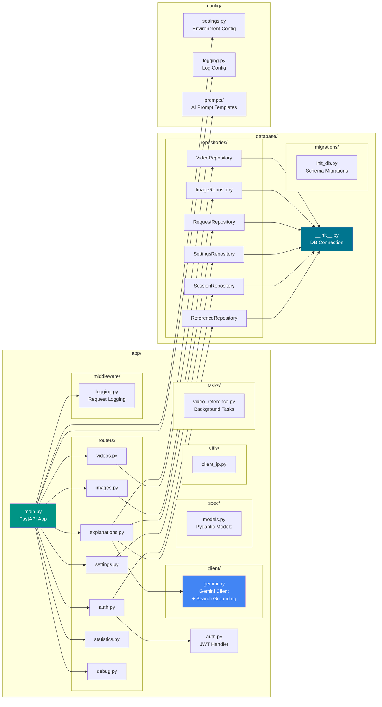
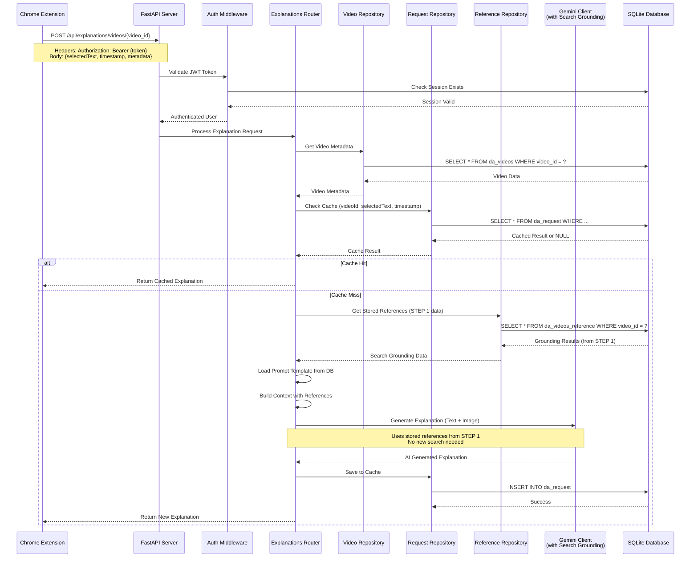
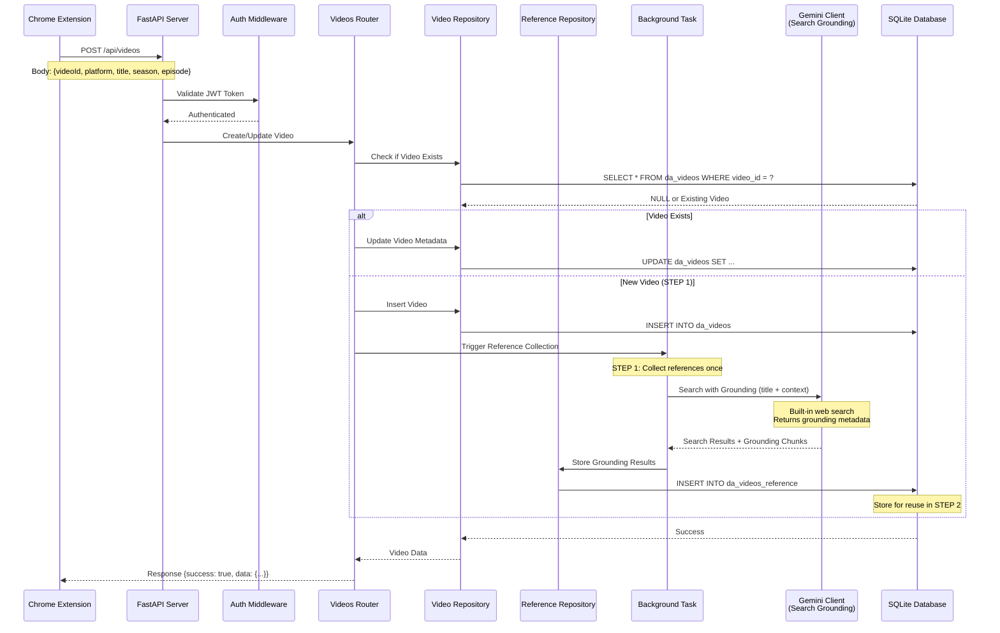
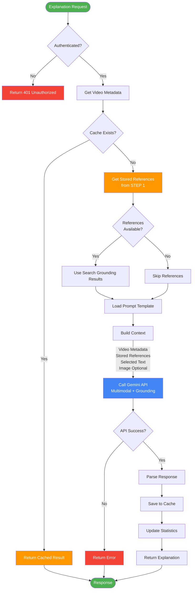
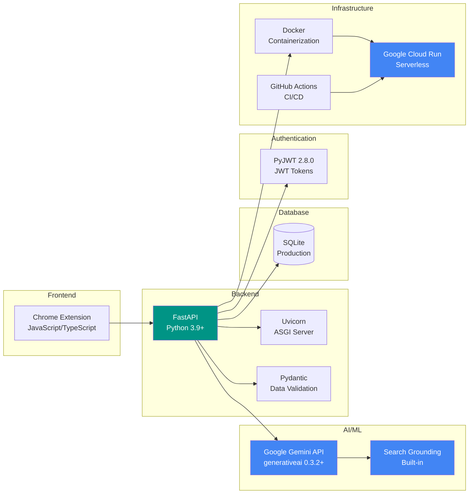

# Docent AI Core - Architecture

This document provides a comprehensive overview of the Docent AI Core system architecture, including component diagrams, data flows, and deployment architecture.

---

## Table of Contents

- [System Overview](#system-overview)
- [Component Architecture](#component-architecture)
- [API Request Flow](#api-request-flow)
- [Explanation Processing Flow](#explanation-processing-flow)
- [Database Schema](#database-schema)
- [Technology Stack](#technology-stack)

---

## System Overview

Docent AI Core is an AI-powered backend API that provides intelligent context and explanations for video subtitles.
It integrates with Chrome Extensions to enhance the viewing experience on platforms like Netflix and YouTube.

**Key Capabilities:**
- Real-time subtitle context analysis
- AI-powered explanations using Google Gemini
- Built-in web search via Gemini Search Grounding
- Screenshot-based multimodal context enhancement
- User session management
- 2-step architecture for cost optimization

---

## Component Architecture



---

## API Request Flow

### 1. Explanation Request Flow (2-Step Architecture)



### 2. Video Registration Flow (STEP 1: Reference Collection)


---

## Explanation Processing Flow



---

## Database Schema
### Core Tables

- `videos` - Video metadata
- `sessions` - JWT authentication
- `requests` - Explanation cache
- `references` - Search Grounding results
- `images` - Uploaded screenshots
- `settings` - App configuration

** Database Schema:** [DATABASE.md](DATABASE.md)

---

## Technology Stack



### Key Technologies

| Category | Technology | Purpose |
|----------|-----------|---------|
| **AI/ML** | Google Gemini API | Multimodal AI explanations |
| **Search** | Gemini Search Grounding | Built-in web search (no separate API needed) |
| **Backend** | FastAPI | High-performance async API framework |
| **Database** | SQLite | Serverless, production-ready database |
| **Auth** | PyJWT | JWT token authentication |
| **Deployment** | Cloud Run | Serverless container deployment |
| **CI/CD** | GitHub Actions | Automated deployment pipeline |

---

## Data Flow Examples

### 1. Complete Video Explanation Flow (2-Step Architecture)

```
STEP 1: Video Registration (Once per video)
─────────────────────────────────────────────
Chrome Extension
    ↓ [POST /api/auth/sessions]
FastAPI (Create Session)
    ↓ [Generate JWT, Store Session]
SQLite (da_session table)
    ↓ [Return sessionId + token]
Chrome Extension (Store token)
    ↓ [POST /api/videos]
FastAPI (Register Video)
    ↓ [Store video metadata]
SQLite (da_videos table)
    ↓ [Background: Search with Grounding]
Gemini API (Search Grounding enabled)
    ↓ [Returns grounding chunks + metadata]
SQLite (da_videos_reference table)
    ✓ [Store for reuse - STEP 1 complete]

STEP 2: Generate Explanations (Many times per video)
────────────────────────────────────────────────────
Chrome Extension
    ↓ [POST /api/explanations/videos/{videoId}]
FastAPI (Check cache → miss)
    ↓ [Load stored references from STEP 1]
SQLite (da_videos_reference, da_settings tables)
    ↓ [Build context with stored grounding data]
FastAPI (Prepare prompt + references + image)
    ↓ [Generate explanation - no new search needed]
Gemini API (Multimodal generation)
    ↓ [Store result in cache]
SQLite (da_request table)
    ↓ [Return explanation]
Chrome Extension (Display)

Benefits:
✓ Search Grounding runs once (STEP 1)
✓ Explanations reuse references (STEP 2)
✓ Cost-effective and fast
```
---

## Key Gemini Features Integration

### 1. Search Grounding

```python
# Enable Search Grounding
from google.generativeai import protos

google_search_tool = protos.Tool(google_search={})
model = genai.GenerativeModel(
    "gemini-2.0-flash-exp",
    tools=[google_search_tool]
)

# Returns grounding_metadata with web sources
response = model.generate_content(prompt)
```

**Benefits:**
- Built-in web search (no separate API)
- Automatic source attribution
Real-time information
- Cost-effective 2-step architecture

### 2. Multimodal Analysis

```python
# Text + Image understanding
content = [
    "Explain this scene:",
    PIL.Image.open("screenshot.jpg")
]
response = model.generate_content(content)
```

**Use Cases:**
- Visual context understanding
- Character identification
- Scene analysis

### 3. Large Context Window

```python
# Entire episode context
prompt = f"""
Video: {video_metadata}
References: {grounding_results}
History: {conversation_history}
Selected: {subtitle_text}

Explain...
"""
```

---

## References

- [Google Gemini API Documentation](https://ai.google.dev/docs)
- [Gemini Search Grounding Guide](https://ai.google.dev/gemini-api/docs/grounding)
- [FastAPI Documentation](https://fastapi.tiangolo.com)


