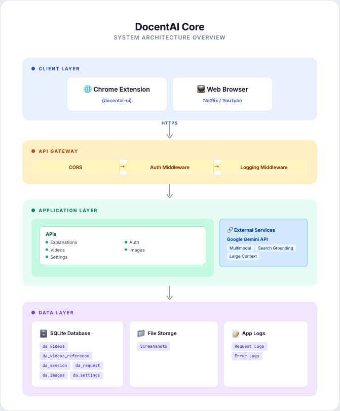

<div align="center">

# DocentAI Core - AI Backend

**AI-Powered Subtitle Explanation Engine**\
*Like a museum docent guiding you through art, \
DocentAI is your AI guide through Netflix narratives — understanding context and explaining clearly*


[](https://docentai-api-1064006289042.asia-northeast3.run.app/health)
[](https://github.com/tnfhrnsss/docentai)
[](https://ai.google.dev/)
[](https://python.org)
[](https://fastapi.tiangolo.com)

🌐 **[Visit Landing Page →](https://tnfhrnsss.github.io/docentai)**

[🚀 Quick Start](#-quick-start) • [🤖 Features](#Key-Features) • [📊 API Docs](API_GUIDE.md) • [☁️ Deployment](#Deployment)

</div>

---

## 🎯 What is DocentAI-Core?

This is the **AI processing engine** for DocentAI - a system that transforms video subtitles into interactive learning experiences.

### 🆚 vs Language Learning Tools

DocentAI is **NOT a language learning tool**. It's a **narrative comprehension tool**.

**DocentAI is for:**
- Native speakers confused by complex plots
- Viewers who want deeper understanding of narratives
- Educational analysis of storytelling
- Accessibility for comprehension difficulties

### System Architecture

```
┌──────────────────┐       ┌──────────────────┐       ┌─────────────────────┐
│ Chrome Extension │ ←───→ │  THIS BACKEND    │ ←───→ │  Google Gemini AI   │
│  (docentai-ui)   │ HTTPS │  (FastAPI/GCP)   │  AI   │  + Search Grounding │
└──────────────────┘       └──────────────────┘       └─────────────────────┘
```

<table>
<tr>
<td width="50%">

### This Repository Contains:
- 🤖 **Gemini AI Integration**
- 🔍 **Search Grounding** (Built-in web search)
- **SQLite Database** (Production-ready)
- **JWT Authentication**
- **Multimodal Analysis** (Text + Image)
- **2-Step Architecture** (Cost optimized)
- ☁**GCP Cloud Run** (Serverless deployment)

</td>
<td width="50%">

### Frontend Repository:
- Chrome Extension
- Netflix/YouTube UI integration
- User interactions
- Context collection

👉 **[See Frontend Repo →](https://github.com/tnfhrnsss/docentai)**

</td>
</tr>
</table>

---

## Key Features

### 1. **Search Grounding**

Built-in web search powered by Gemini API - no separate Search API needed!

### 2. **2-Step Architecture**

Smart reference caching for optimal performance and cost.

```
STEP 1: Video Registration
  └─> Gemini Search Grounding (once)
  └─> Store references in DB

STEP 2: Generate Explanations (many times)
  └─> Use stored references
  └─> Fast & cost-effective
```

### 3. **Multimodal Analysis**

Understand beyond just text:

- **Text**: Subtitle + conversation history
- **Image**: Screenshots for visual context
- **Audio cues**: [Sound effects], ambient sounds
- **Actions**: (Character movements), (Facial expressions)
- **External**: Search Grounding results

[See detailed architecture →](ARCHITECTURE.md)

---

## 🎬 Demo

See DocentAI in action:

[](https://youtu.be/BUbfO1P8-Bs)

**[▶️ Watch Demo Video](https://youtu.be/BUbfO1P8-Bs)**

---

## 🚀 Quick Start

### Prerequisites

```bash
# Required
- Python 3.9 or higher
- pip (Python package manager)

# Optional
- Docker (for containerized deployment)
- Google Cloud SDK (for GCP deployment)
```

### 1. Clone Repository

```bash
git clone https://github.com/tnfhrnsss/docentai-core
cd docentai-core
```

### 2. Set Up Virtual Environment

```bash
# Create virtual environment
python -m venv .venv

# Activate (macOS/Linux)
source .venv/bin/activate

# Activate (Windows)
.venv\Scripts\activate
```

### 3. Install Dependencies

```bash
pip install -r requirements.txt
```

### 4. Configure Environment

```bash
# Copy example environment file
cp .env.example .env

# Edit .env with your credentials
```

**Required Environment Variables:**

```bash
# Required
GEMINI_API_KEY=your-gemini-api-key-here
JWT_SECRET_KEY=your-secret-key-here

# Optional (defaults provided)
DATABASE_PATH=./data/docent.db
IMAGE_UPLOAD_PATH=./data/uploads
LOG_LEVEL=INFO
PORT=8001
```

**Get Your API Key:**
- **Gemini API**: [Google AI Studio](https://makersuite.google.com/app/apikey)

### 5. Run Development Server

```bash
# Development mode (auto-reload)
uvicorn app.main:app --reload --port 8001

# Or using Python module
python -m app.main

# Server running at: http://localhost:8001
```

### 6. Verify Installation

```bash
# Health check
curl http://localhost:8001/health

# Expected response:
# {"status": "healthy", "timestamp": "..."}

# Interactive API documentation
open http://localhost:8001/docs
```

---

## 🐳 Docker Deployment

### Using Docker Compose (Recommended)

```bash
# Build and start
docker-compose up -d

# View logs
docker-compose logs -f

# Stop
docker-compose down
```

### Using Docker Directly

```bash
# Build image
docker build -t docentai-api:latest .

# Run container
docker run -p 8001:8001 --env-file .env docentai-api:latest

# Test
curl http://localhost:8001/health
```

---

## 📊 API Endpoints

### Core Endpoints

| Endpoint | Method | Description |
|----------|--------|-------------|
| `/api/auth/sessions` | POST | Create session (login) |
| `/api/videos` | POST | Register video (STEP 1) |
| `/api/explanations/videos/{id}` | POST | Get explanation (STEP 2) |
| `/api/images` | POST | Upload screenshot |
| `/api/settings` | GET/PUT | Manage settings |
| `/api/statistics/*` | GET | Usage statistics |
| `/health` | GET | Health check |


** API Documentation:** [API_GUIDE.md](API_GUIDE.md)

---

## Architecture



### Component Overview

```
docentai-core/
├── app/
│   ├── routers/           # API endpoints
│   ├── client/            # Gemini AI integration
│   ├── middleware/        # Request processing
│   ├── tasks/             # Background jobs
│   └── spec/              # Data models
├── config/                # Configuration
│   └── prompts/           # AI prompt templates
├── database/              # Database layer
│   ├── migrations/        # Schema migrations
│   └── repositories/      # Data access
├── data/                  # Runtime data
└── logs/                  # Application logs
```

** Detailed Architecture:** [ARCHITECTURE.md](ARCHITECTURE.md)

---

## Deployment

### Google Cloud Run (Production)

**Current Status:** ✅ Live at `https://docentai-api-1064006289042.asia-northeast3.run.app`

### Local Server

```bash
# 1. Setup
git clone https://github.com/tnfhrnsss/docentai-core
cd docentai-core

# 2. Install
python -m venv .venv
source .venv/bin/activate
pip install -r requirements.txt

# 3. Configure
cp .env.example .env
# Edit .env

# 4. Run
python -m uvicorn app.main:app --reload --host 0.0.0.0 --port 8001
```

---

## Database

DocentAI uses **SQLite** for production-ready, serverless data storage.

### Core Tables

- `videos` - Video metadata
- `sessions` - JWT authentication
- `requests` - Explanation cache
- `references` - Search Grounding results
- `images` - Uploaded screenshots
- `settings` - App configuration

** Database Schema:** [DATABASE.md](DATABASE.md)

---

## Security & Privacy

### No Personal Data Collection

**do NOT collect:**
- ❌ User names or emails
- ❌ Browsing history
- ❌ IP addresses (except temporary logs)

### Security Features

- HTTPS/TLS encryption
- JWT-based authentication
- CORS protection
- SQL injection prevention

---

## Documentation

### Quick Links

- [**ARCHITECTURE.md**](ARCHITECTURE.md)
- [**API_GUIDE.md**](API_GUIDE.md)
- [**DATABASE.md**](DATABASE.md)

---

## Key Gemini Features Used

```
1. Search Grounding
   - Built-in web search
   - Automatic source attribution
   - No separate API needed

2. Multimodal Analysis
   - Text + Image understanding
   - Unified processing

3. Large Context Window
   - Entire episode context
   - Conversation history

4. Cost-Effective
   - 2-step architecture
   - Smart caching
```

---

## Related Repositories

| Repository | Description | Role |
|------------|-------------|------|
| **[docentai-core](https://github.com/tnfhrnsss/docentai-core)** | AI Backend (You are here) | AI Processing |
| **[docentai](https://github.com/tnfhrnsss/docentai)** | Chrome Extension | User Interface |

---

## License

MIT License - See [LICENSE](LICENSE) for details

---

<div align="center">

**This is the AI backend for DocentAI.**

**For the Chrome Extension:**
**👉 [Visit docentai →](https://github.com/tnfhrnsss/docentai)**

---

[⬆ Back to Top](#docentai-core---ai-backend)

</div>
